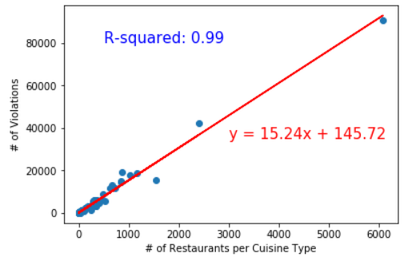
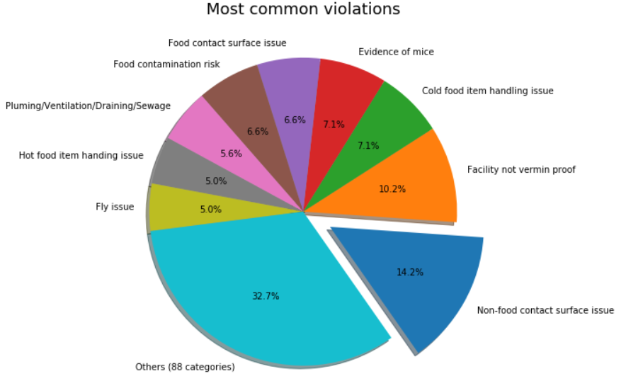

# Analysis of NYC Restaurant Inspections

## Background

This short-term and simple project analyzes violations that were made by NYC restaurants. Especially, we were interested in two types of analysis:

1. Is there any correlation between cuisine type and violations
2. What are the most common violations

## Team Members

Daewon Kwon, Gabriella Geron, Nidhi G, Pratik Pathak

## Data Source

https://www.kaggle.com/new-york-city/nyc-inspections

## Data Clean-up

1. Thare are more than 400,000 records and many records are not valid. Inspection showed that those invalid record contains inspection date as 01/0/1900. Once we read using Pandas, we dropped those records with the inspection date.
2. Once we cleaned and sorted (by date), we counted the number of records as 398,783.

## Is there any correlcation between the number of violations and cuisine type

1. There are 84 cuisine types in the dataset. For example, cuisine type includes bakery, hamburgers, chinese, etc.
2. Analysis showed that there is not enough correlation between cuisine time to the number of violations
3. No matter what type of cuisine type, each restaurant commits about 15 violations over 7 year period of time.

## Common violations

Below chart shows 9 most common violations

